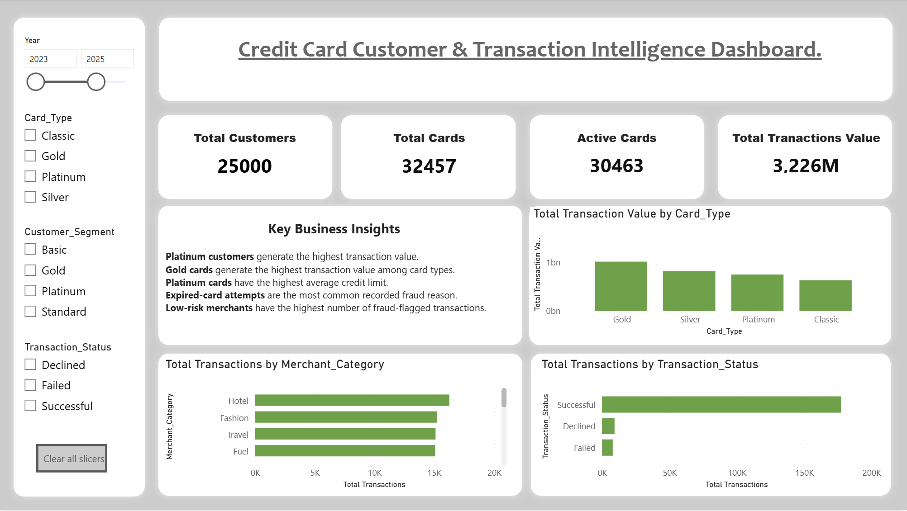
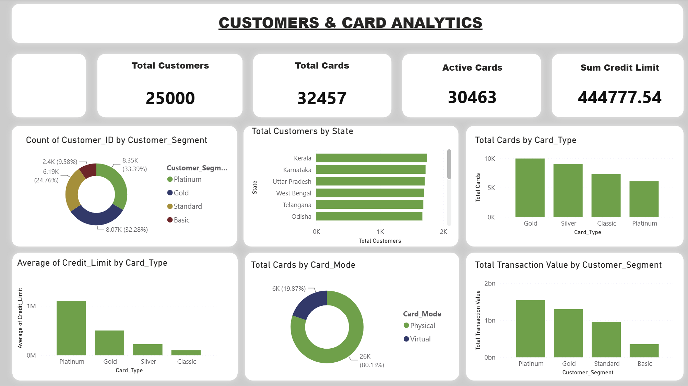
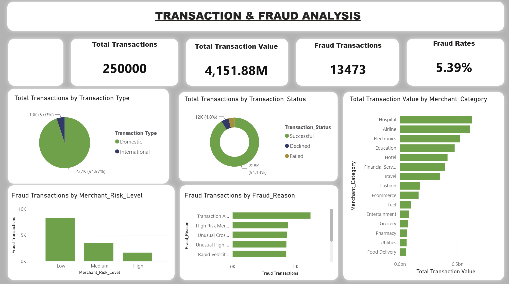
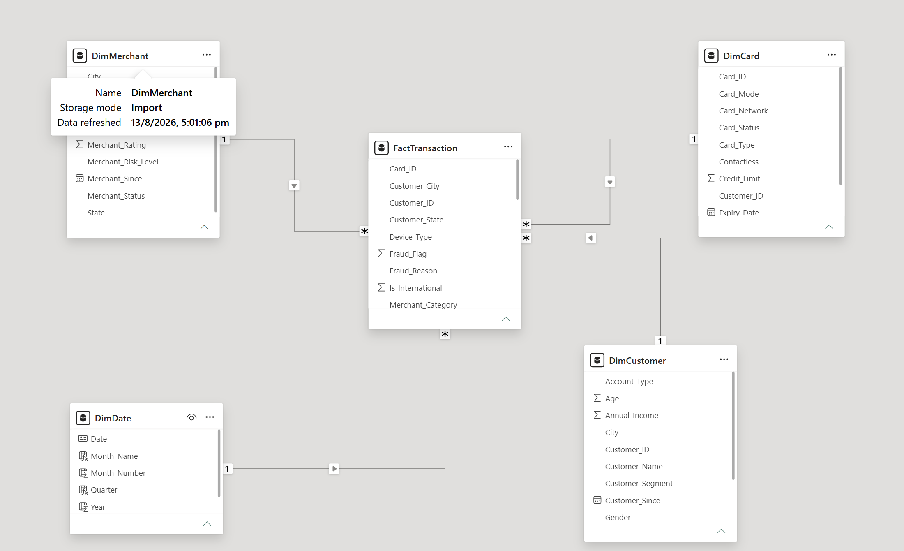
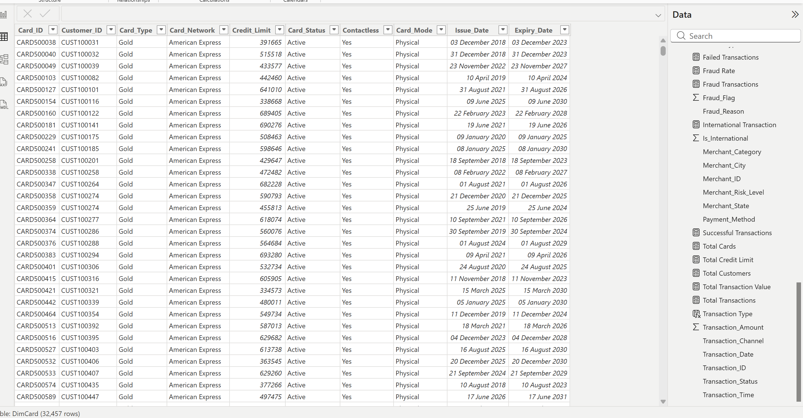

# Credit Card Customer & Transaction Analytics

## 📊 Project Overview

This project analyzes customer behavior, card performance, transaction patterns, and fraud indicators using Power BI.

The dashboard was built using a dataset containing:

- 25,000+ customers
- 32,000+ cards
- 250,000 transactions
- 500+ merchants

The objective was to transform raw transactional data into an interactive business intelligence dashboard that can help stakeholders understand customer segments, card usage, transaction behavior, and fraud patterns.

---

## 🛠️ Tools & Technologies

- Power BI
- Power Query
- DAX
- Data Modeling
- Data Cleaning
- Data Visualization
- KPI Analysis
- Business Intelligence

---

## 📁 Data Model

The project uses four main tables:

- Customer Data
- Card Data
- Transaction Data
- Merchant Data

A dedicated Date table was also created for time-based analysis.

The tables were cleaned, transformed, and connected using relationships in Power BI.

---

## 📈 Dashboard Pages

### 1. Executive Overview

Provides a high-level view of:

- Total customers
- Total cards
- Active cards
- Transaction value
- Card-type performance
- Transaction status
- Merchant category activity

### 2. Customer & Card Analytics

Analyzes:

- Customer segments
- Customer distribution by state
- Card types
- Active cards
- Physical vs virtual cards
- Credit limits
- Transaction value by customer segment

### 3. Transaction & Fraud Analysis

Analyzes:

- Total transactions
- Transaction value
- Fraud transactions
- Fraud rate
- Domestic vs international transactions
- Transaction status
- Merchant categories
- Merchant risk levels
- Fraud reasons

---

## 💡 Key Insights

Some notable observations from the analysis include:

1. Platinum customers generate the highest transaction value among customer segments.

2. Platinum cards have the highest average credit limit among card types.

3. Gold cards generate the highest transaction value among card types.

4. Transaction attempts involving expired cards are the most common recorded fraud reason.

5. Fraud-flagged transactions are present across different merchant risk levels.

---

## 🎯 Business Questions

The dashboard was designed to answer questions such as:

- Which customer segments generate the highest transaction value?
- Which card types contribute most to transaction value?
- How are customers distributed across different segments and states?
- What proportion of cards are active?
- What percentage of transactions are international?
- What are the most common recorded fraud reasons?
- How do fraud transactions vary across merchant risk levels?
- Which merchant categories generate the highest transaction value?

---

## 📷 Dashboard Preview

### Executive Overview

### Customer & Card Analytics

### Transaction & Fraud Analysis

### Data Model

### Power Query Data Cleaning

---

## 📂 Project Files

- `Project01.pbix` — Power BI dashboard
- Dashboard screenshots
- Data model and Power Query screenshots

> Raw datasets are not included in this public repository.

---

## 👨‍💻 Author

**Akash Kamal**

Aspiring Data Analyst | Power BI | SQL | Excel | Python

---

⭐ This project is part of my Data Analytics portfolio and demonstrates practical experience in data cleaning, data modeling, DAX, KPI development, visualization, and business analysis.
